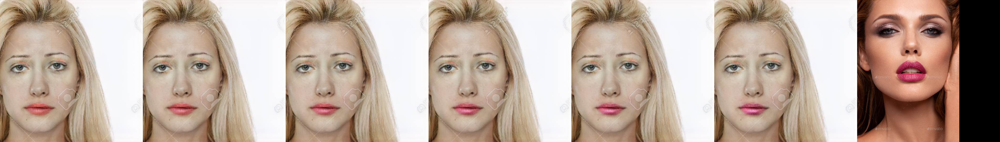

# makeup

## Original 3D reconstruction

Fork on repository  "PSGAN: Pose and Expression Robust Spatial-Aware GAN for Customizable Makeup Transfer".
https://github.com/wtjiang98/PSGAN 
Simple Streamlit web application deployed using kubernetes on GCP

Extended functionality not present in the official repo but mentioned in the paper:
-Partial makeup transfer (skin, lips and eyes)
-Interpolated makeup styles (1 or 2 reference images)
